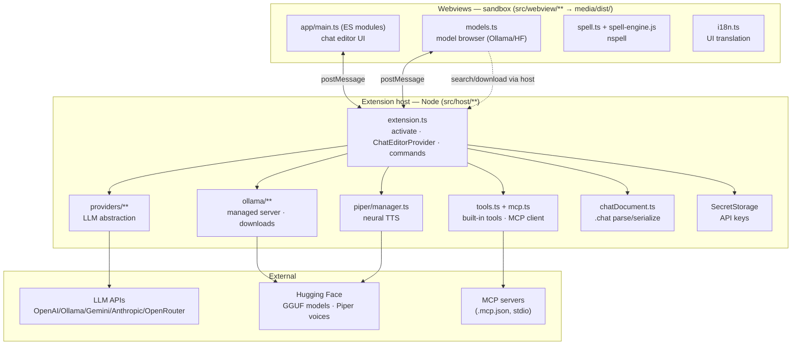
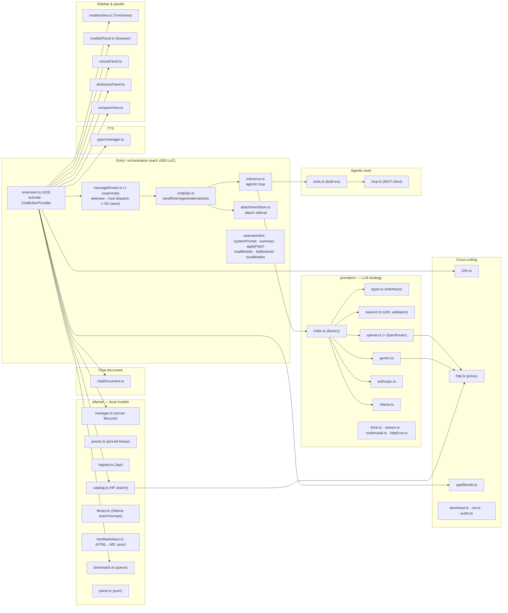
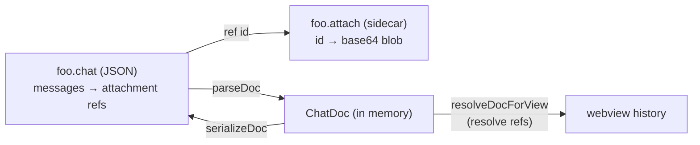
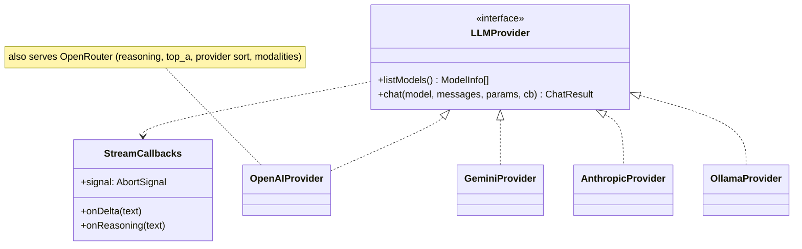
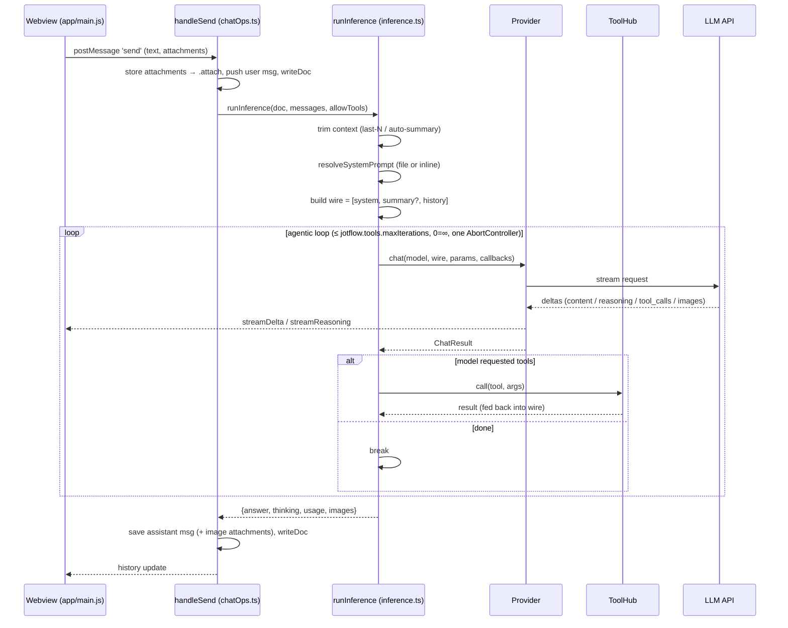
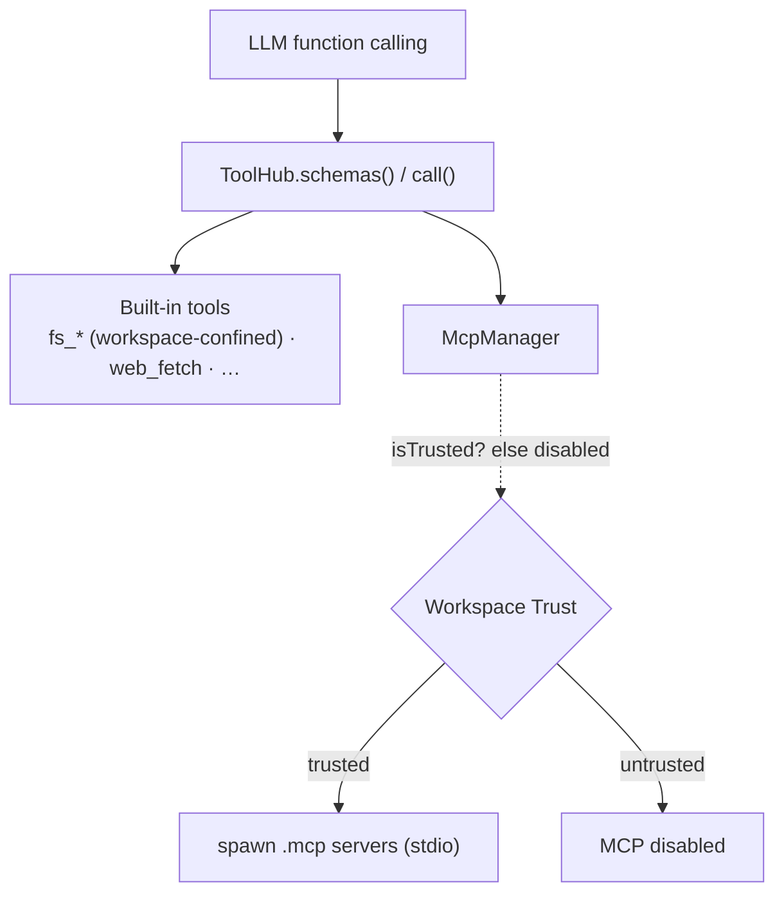
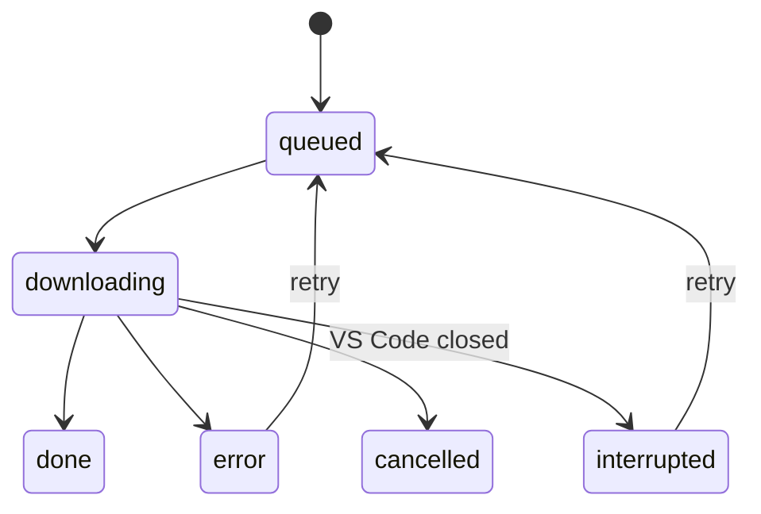
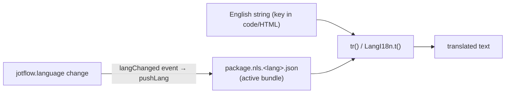

# Jotflow — Architecture

A VS Code extension that turns a `.chat` file into a full chat editor for LLMs, with
pluggable backends (LM Studio / OpenAI-compatible, Ollama, Google Gemini, Anthropic,
OpenRouter), local model & voice management (Ollama + Piper TTS), an agentic tool loop
(built-in filesystem tools + MCP servers), live spell-check, multi-language UI, and
neural text-to-speech.

> Conventions: **English is the source language** for code and these docs. User-facing
> strings are English keys translated via `package.nls.<lang>.json` bundles.

---

## 1. The big picture

Everything runs in two worlds that talk over `postMessage`:

- **Extension host** (Node.js, `src/host/**`): owns the document, the network, processes
  (Ollama, Piper, MCP), secrets, and the filesystem.
- **Webviews** (browser sandbox, source in `src/webview/**`, bundled to `media/dist/`): render the
  chat UI and the model browser. They have **no** filesystem/network access of their own — they ask
  the host. Pure isomorphic logic shared by both worlds lives in `src/shared/` (e.g. `zoomMath.ts`).

---

## 2. Module map

> **Modularization invariant: no source file exceeds 500 lines.** The former god-files were
> split by concern (high cohesion, low coupling) with **explicit dependencies** — no global
> bridges. The host passes deps as plain function args / a single context object; the webview
> uses real ES-module `import`/`export`.

**Pure, testable cores** (no VS Code / no network, unit-tested in `src/host/test/`):
`chatHelpers.ts`, `findReplace.ts`, `ollama/parse.ts`, `ollama/assets.ts`, `ollama/htmlMarkdown.ts`,
`providers/multimodal.ts`, `net.ts`, `audio.ts`, `download.ts`. The HTML-scraping parsers in
`ollama/library.ts` (search / tags / cloud / README) are pure and unit-tested too; only its fetch
wrappers touch the network.

---

## 3. The chat document

A chat is a **`.chat` file** (JSON) opened by a `CustomTextEditorProvider`. The file is the
single source of truth; the webview is a projection of it.

- **`<name>.chat`** — JSON: provider, model, params, system prompt (inline or a referenced
  file), messages (role/content/thinking/variants/attachments-as-refs), and the context
  summary. Parsed/serialized by `chatDocument.ts`.
- **`<name>.attach`** — sidecar holding attachment **blobs** (base64 images/docs) keyed by id.
  Messages store only `{kind,name,mime,ref}`; blobs are resolved for the webview and pruned
  when no longer referenced (incl. inside variants).

Edits go through a `WorkspaceEdit` that replaces the whole text (`writeDoc`). VS Code's
text **undo/redo is neutralized** for `.chat` (it would step through the many internal
writes of a turn) — the chat owns its own history via delete/edit/regenerate/fork.

Persistent state outside the document lives in **globalStorage**: the Ollama binary,
downloaded Piper voices, `spell-words.json`, the download queue, and local-model cards.

---

## 4. Providers — the LLM abstraction

All backends implement one interface; `buildProvider()` is the factory. Each provider maps
the generic `ChatMessage[]` to its wire format, streams the response, and returns a
normalized `ChatResult` (`answer`, `thinking`, `toolCalls`, `usage`, `images`).

- **OpenAIProvider** — OpenAI-compatible (LM Studio, llama.cpp, vLLM…) **and** OpenRouter.
  Handles `<think>` splitting, `reasoning`/`reasoning_details`, tool-call accumulation, and
  image-output (`modalities`).
- **GeminiProvider** — Generative Language API; system → `systemInstruction`, image output
  via `responseModalities`.
- **AnthropicProvider** — Messages API; system extracted to the top-level `system`.
- **OllamaProvider** — native `/api/chat`.

Shared helpers: `think.ts` (reasoning splitter), `stream.ts` (NDJSON/SSE line reader with a
runaway-line cap), `multimodal.ts` (attachment + image-output detection), `httpError.ts`
(human error messages), `http.ts` (proxy-aware `fetch`).

---

## 5. Inference flow (the agentic loop)

Context management before sending: **"last N messages"** (token-budget capped) **or**
**auto-summary** (compacts older turns into a running summary against the model window).

---

## 6. Tools & MCP

`ToolHub` aggregates **built-in tools** and **MCP server tools** into one schema list for the
provider's function-calling.

- **Built-in** (`tools.ts`): `fs_list`, `fs_read`, `fs_write`, `fs_glob`, `fs_search`,
  `get_datetime`, `web_fetch`, `editor_context`. File tools are **confined to the workspace**
  (resolved path must stay under a workspace folder, with `realpath` to defeat symlink
  escape). `fs_write` additionally requires a **trusted** workspace.
- **MCP** (`mcp.ts`): a minimal stdio JSON-RPC 2.0 client. Servers are declared in
  `.mcp.json` / `.mcp/*.json` and spawned **only in trusted workspaces** (a malicious repo's
  config would otherwise be RCE). Tools are namespaced `server__tool`.

---

## 7. Local engines

### Ollama (managed local models)

`ollama/manager.ts` can run a **self-contained Ollama**: it downloads the pinned binary
(`assets.ts`, SHA-256 verified) into globalStorage and runs `serve` on a free port —
independent of any system install. `registry.ts` talks to `/api/*`; the model explorer searches
the **Ollama library** (`library.ts`, default) or **Hugging Face** GGUF (`catalog.ts`), selected by
`jotflow.models.source`; `downloads.ts` is a persistent, observable download queue.

Downloads run as a native `ollama pull` (with resume) or, when Hugging Face can't resolve the
`:quant` tag / the model is **split** into shards, fall back to downloading the `.gguf`(s) and
`ollama create` (import mode). A pre-flight probe and a runtime "400" backstop route broken
manifests to import automatically.

`library.ts` scrapes ollama.com (search / tags / model page — no public JSON API) for the Ollama
catalog: downloadable quants, **cloud variants** (`name:cloud`, registered via a stub `pull`), and
the model's README (converted to Markdown by `htmlMarkdown.ts`) + Context/Size. **Cloud models**
run remotely; the managed server proxies them once authenticated — the Ollama API key
(`jotflow.ollama.apiKey` / SecretStorage) is passed to `ollama serve` as `OLLAMA_API_KEY`.

### Piper (neural TTS)

`piper/manager.ts` bootstraps a self-contained Python (or system Python), a venv with
`piper-tts[http]`, and runs an **HTTP daemon** so the model stays resident. Curated voices
(per language, SHA-256 pinned) download on demand into globalStorage. The chat streams
sentence chunks and plays the returned WAV.

---

## 8. Webviews

The **chat editor** is a graph of **ES modules** (`<script type="module">`) under `media/`,
grouped by concern (each ≤500 lines, explicit `import`/`export` — no `window.*` bridges):

| Layer (`media/`) | Modules | Role |
|---|---|---|
| `core/` | `vscode` · `icons` · `i18n` · `dom` | VS Code API handle, SVG icons, `t()`, DOM helpers + tooltips |
| `render/` | `markdown` · `mermaid` | Markdown renderer (memoized) · Mermaid render + pan/zoom viewer |
| `ui/` | `store` · `notifications` | single owner of `doc` (getDoc/setDoc/subscribe) · banners + summarizing indicator |
| `features/` | `tts` · `find` · `autocomplete` · `spell` | read-aloud · find&replace · emoji/`@file` popups · spell overlay |
| `chat/` | `message` · `conversation` · `composer` | one bubble · render + streaming + side panels · input/attachments/send |
| `panels/` | `config` · `models` | ⚙ params + voices · status + model selector + context-budget bar |
| `app/` | `protocol` · `main` | host→webview message dispatch · bootstrap + wiring |

The **entry** is `app/main.js`; classic scripts that publish window globals
(`zoom.js` → `LangZoom`, `i18n.js` → `LangI18n`, `spell-engine.js`/`spell.js` → `LangSpell`)
load **first**, then the deferred module graph. **State has single owners**: `ui/store.js`
owns `doc`; `chat/conversation.js` owns the streaming/tool state; `chat/composer.js` owns the
send busy-state. The **protocol** dispatches host messages by calling feature functions — it
never mutates another module's state directly. A `src/webview/tsconfig.json` + `globals.d.ts`
type-check the whole graph (the webview has no runtime tests, so this catches
broken imports / undefined identifiers).

Other webviews stay single classic scripts: **model browser** (`models.js` + `models.css`),
and the small **voices / dictionary / compare** panels. Spell-check runs **in the webview**
(`nspell` + bundled hunspell dictionaries in `media/dict`), drawing a wavy underline on a
mirror "backdrop" behind the textarea. The model browser does its catalog search (Ollama library or
Hugging Face) and its README rendering **through the host** (it has no network); scraped content is
escaped / `sanitizeHtml`'d under the panel's strict CSP.

---

## 9. Internationalization

English is the key. Each language ships a `package.nls.<lang>.json` bundle (also VS Code's
manifest bundle). The **active** bundle is injected into webviews as `window.I18N_BUNDLE`; a
live language change re-pushes a fresh bundle so the UI re-translates without reload.
Supported: `en, es, pt, fr, de, it` (UI, spell-check, and Piper voices).

---

## 10. Security

- **Workspace Trust** is the gate for code execution: MCP servers, `fs_write`, and the Piper
  **system-Python fallback** (a `python`/`py` resolved via `PATH`) are disabled in untrusted
  workspaces (`untrustedWorkspaces: limited`). Enabling **Tools** in an untrusted workspace nudges
  the user (warning + **Manage Trust** → `workbench.trust.manage`) up front, so tools don't fail
  mid-turn — trust itself is still granted only through VS Code's own UI.
- **Backend URL validation**: every configured `baseUrl` passes through `providers/baseUrl.ts`
  before use — malformed URLs and non-`http(s)` schemes are rejected, and attaching an **API key
  over plaintext `http` to a non-loopback host is refused** (the key would travel in cleartext).
- **Path confinement**: filesystem tools resolve and `realpath`-check every path against the
  workspace roots (blocks `../` and symlink escape).
- **API keys** live in **SecretStorage** (encrypted), entered via a masked input command, not
  in plaintext settings. The **Ollama Cloud** key reaches only the loopback managed server as
  `OLLAMA_API_KEY`; it is never sent over the network by the extension nor exposed to the webview.
- **Scraped catalog content** (ollama.com search/tags/README) is fetched over a fixed host
  (encoded paths → no SSRF), HTML-escaped, and the README is tag-stripped → re-rendered →
  `sanitizeHtml`'d, with the model browser's strict CSP as the backstop.
- **Network** goes through `http.ts` (respects `http.proxy` / env proxy). Binaries (Ollama,
  Piper, voices, GGUFs) are **SHA-256 verified** before use (fail-closed). `web_fetch` blocks SSRF:
  it validates the resolved IP **at connect time** (anti DNS-rebinding) and re-checks the host at
  every redirect hop.
- **Webview CSP**: scripts are **nonce-locked** (`script-src 'nonce-…' 'strict-dynamic'`, no
  inline/eval). `'strict-dynamic'` lets the nonce'd module entry (`app/main.js`) statically
  import the rest of the graph (imports carry no nonce); the lazily-loaded Mermaid bundle is
  injected with that nonce. `style-src` keeps `'unsafe-inline'` **only** for Mermaid's generated SVG
  (per-node `style=` attributes a nonce/hash can't cover) — the extension's own DOM no longer relies
  on it (the one inline-style use, the download bar, sets its width via the CSSOM). Diagrams render
  with `securityLevel: 'strict'`.

---

## 11. Build & packaging

- All hand-written source lives under `src/`, split by runtime: `src/host/**` (Node), `src/webview/**`
  (browser sandbox), `src/shared/**` (pure, isomorphic). TypeScript (`src/host/**` + `src/shared/**`
  → `out/**`) via `tsc` (type-check + `node:test`); ESLint. The code carries **no `any`-as-a-type** —
  external JSON / VS Code boundaries use `unknown` with explicit narrowing or a named `Raw*`/response
  interface, so a typo on a parsed shape is a compile error.
- The shipped extension host is **bundled with esbuild** (`npm run bundle` → a single minified
  `dist/extension.js`, `main`; `undici` inlined, `vscode` external). `.vscodeignore` then excludes
  `out/`, `node_modules/` and `src/` from the `.vsix` (T12 — a small, fast package).
- The webview is **also bundled with esbuild** (`npm run build:webview` → `media/dist/`: `app.js`
  for the chat module graph + one IIFE per classic/standalone panel + `spell-engine.js`). Source is
  `src/webview/**`; only `media/` (CSS, images, the vendored `mermaid.min.js`, `dict/` data, and the
  generated `dist/`) is served to the webview via `asWebviewUri`. `media/dist/` is git-ignored and
  built on dev/publish. Type-checking is a separate gate, not emitted: `npm run typecheck:webview`
  (`tsc -p src/webview/tsconfig.json`, `checkJs` + `globals.d.ts`).
- Packaged with `@vscode/vsce`; published from `master` by a **manual** GitHub Actions
  workflow (`.github/workflows/release.yml`) gated by a `marketplace` environment approval.
  The published version is `package.json`'s `version` (idempotent — re-publishing an existing
  version is a no-op).

---

## Where to start reading

1. `src/host/extension.ts` — `activate()` and the `ChatEditorProvider` wiring; then
   `src/host/messageRouter.ts` (dispatch), `src/host/chatOps.ts` (turn ops), `src/host/inference.ts` (the loop).
2. `src/host/providers/types.ts` + `index.ts` — the LLM abstraction.
3. `src/host/chatDocument.ts` — the `.chat` data model.
4. `src/webview/app/main.ts` — the chat webview entry; then `src/webview/app/protocol.ts` and the
   `core/ → render/ → ui/ → features/ → chat/ → panels/` module layers.
