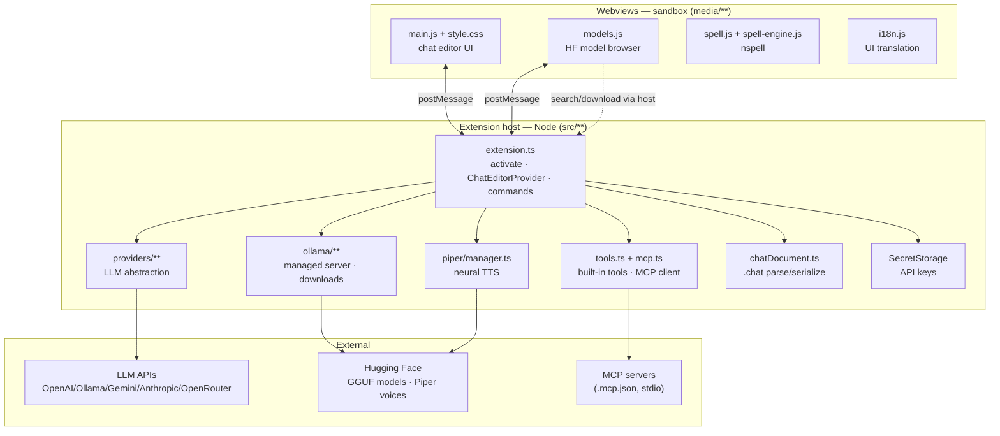
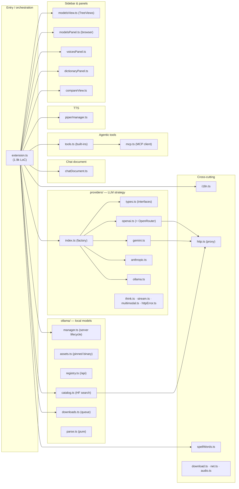
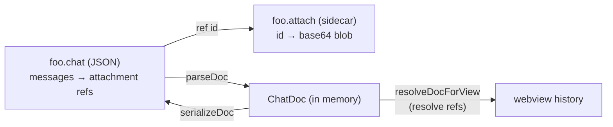
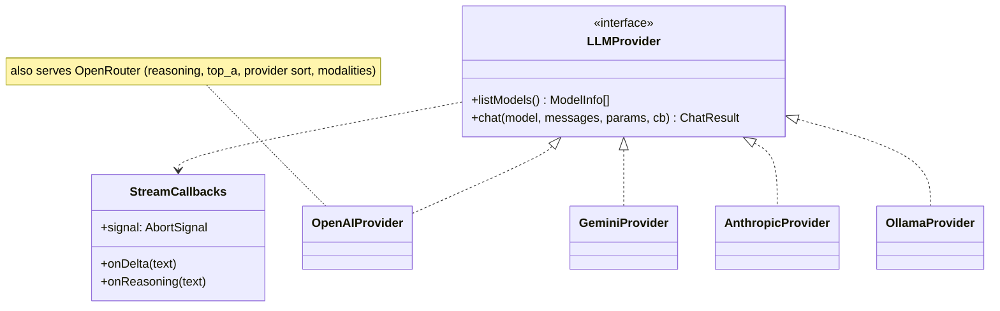
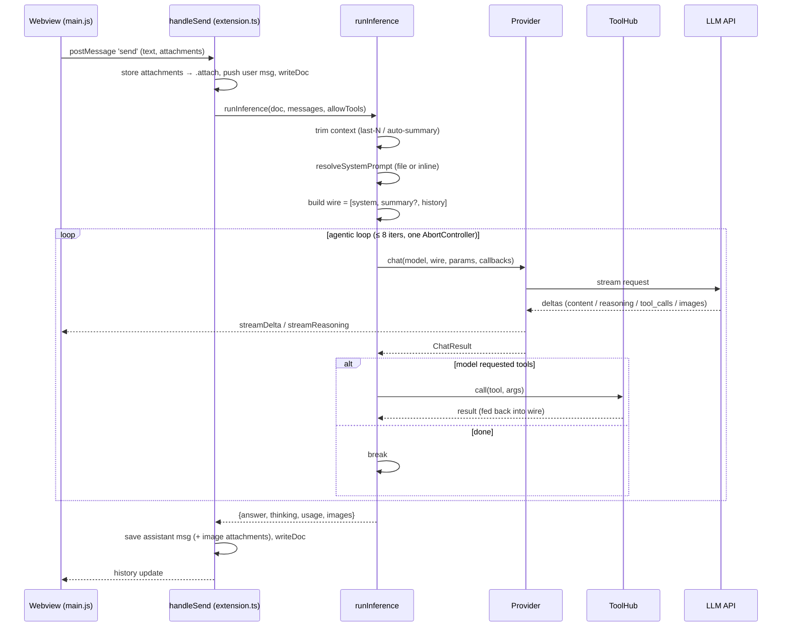
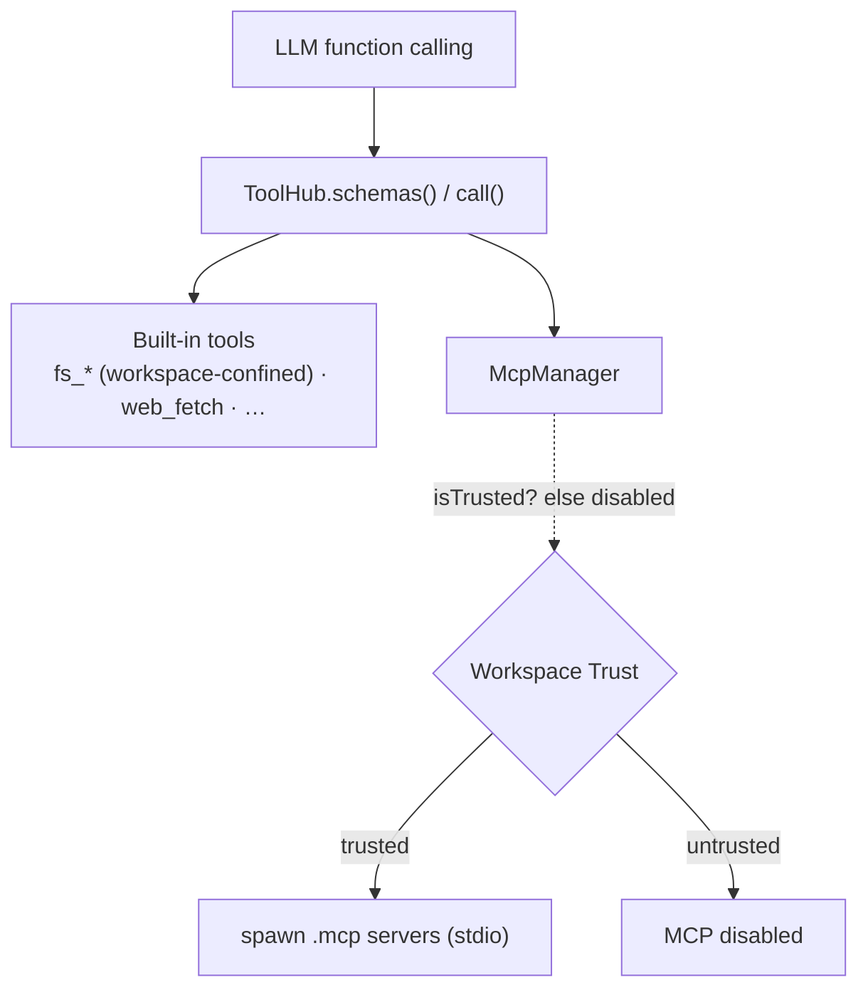
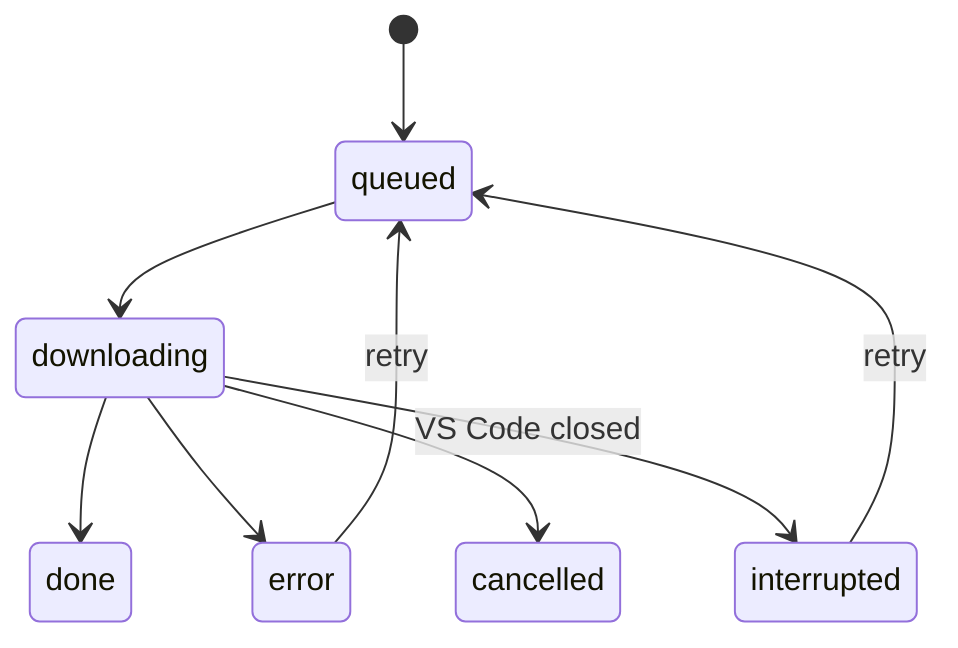

# Parley — Architecture

A VS Code extension that turns a `.chat` file into a full chat editor for LLMs, with
pluggable backends (LM Studio / OpenAI-compatible, Ollama, Google Gemini, Anthropic,
OpenRouter), local model & voice management (Ollama + Piper TTS), an agentic tool loop
(built-in filesystem tools + MCP servers), live spell-check, multi-language UI, and
neural text-to-speech.

> Conventions: **English is the source language** for code and these docs. User-facing
> strings are English keys translated via `package.nls.<lang>.json` bundles.

---

## 1. The big picture

Everything runs in two worlds that talk over `postMessage`:

- **Extension host** (Node.js, `src/**`): owns the document, the network, processes
  (Ollama, Piper, MCP), secrets, and the filesystem.
- **Webviews** (browser sandbox, `media/**`): render the chat UI and the model browser.
  They have **no** filesystem/network access of their own — they ask the host.

---

## 2. Module map

**Pure, testable cores** (no VS Code / no network, unit-tested in `src/test/`):
`ollama/parse.ts`, `ollama/assets.ts`, `providers/multimodal.ts`, `net.ts`, `audio.ts`,
`download.ts`.

---

## 3. The chat document

A chat is a **`.chat` file** (JSON) opened by a `CustomTextEditorProvider`. The file is the
single source of truth; the webview is a projection of it.

- **`<name>.chat`** — JSON: provider, model, params, system prompt (inline or a referenced
  file), messages (role/content/thinking/variants/attachments-as-refs), and the context
  summary. Parsed/serialized by `chatDocument.ts`.
- **`<name>.attach`** — sidecar holding attachment **blobs** (base64 images/docs) keyed by id.
  Messages store only `{kind,name,mime,ref}`; blobs are resolved for the webview and pruned
  when no longer referenced (incl. inside variants).

Edits go through a `WorkspaceEdit` that replaces the whole text (`writeDoc`). VS Code's
text **undo/redo is neutralized** for `.chat` (it would step through the many internal
writes of a turn) — the chat owns its own history via delete/edit/regenerate/fork.

Persistent state outside the document lives in **globalStorage**: the Ollama binary,
downloaded Piper voices, `spell-words.json`, the download queue, and local-model cards.

---

## 4. Providers — the LLM abstraction

All backends implement one interface; `buildProvider()` is the factory. Each provider maps
the generic `ChatMessage[]` to its wire format, streams the response, and returns a
normalized `ChatResult` (`answer`, `thinking`, `toolCalls`, `usage`, `images`).

- **OpenAIProvider** — OpenAI-compatible (LM Studio, llama.cpp, vLLM…) **and** OpenRouter.
  Handles `<think>` splitting, `reasoning`/`reasoning_details`, tool-call accumulation, and
  image-output (`modalities`).
- **GeminiProvider** — Generative Language API; system → `systemInstruction`, image output
  via `responseModalities`.
- **AnthropicProvider** — Messages API; system extracted to the top-level `system`.
- **OllamaProvider** — native `/api/chat`.

Shared helpers: `think.ts` (reasoning splitter), `stream.ts` (NDJSON/SSE line reader with a
runaway-line cap), `multimodal.ts` (attachment + image-output detection), `httpError.ts`
(human error messages), `http.ts` (proxy-aware `fetch`).

---

## 5. Inference flow (the agentic loop)

Context management before sending: **"last N messages"** (token-budget capped) **or**
**auto-summary** (compacts older turns into a running summary against the model window).

---

## 6. Tools & MCP

`ToolHub` aggregates **built-in tools** and **MCP server tools** into one schema list for the
provider's function-calling.

- **Built-in** (`tools.ts`): `fs_list`, `fs_read`, `fs_write`, `fs_glob`, `fs_search`,
  `get_datetime`, `web_fetch`, `editor_context`. File tools are **confined to the workspace**
  (resolved path must stay under a workspace folder, with `realpath` to defeat symlink
  escape). `fs_write` additionally requires a **trusted** workspace.
- **MCP** (`mcp.ts`): a minimal stdio JSON-RPC 2.0 client. Servers are declared in
  `.mcp.json` / `.mcp/*.json` and spawned **only in trusted workspaces** (a malicious repo's
  config would otherwise be RCE). Tools are namespaced `server__tool`.

---

## 7. Local engines

### Ollama (managed local models)

`ollama/manager.ts` can run a **self-contained Ollama**: it downloads the pinned binary
(`assets.ts`, SHA-256 verified) into globalStorage and runs `serve` on a free port —
independent of any system install. `registry.ts` talks to `/api/*`; `catalog.ts` searches
Hugging Face for GGUF models; `downloads.ts` is a persistent, observable download queue.

Downloads run as a native `ollama pull` (with resume) or, when Hugging Face can't resolve the
`:quant` tag / the model is **split** into shards, fall back to downloading the `.gguf`(s) and
`ollama create` (import mode). A pre-flight probe and a runtime "400" backstop route broken
manifests to import automatically.

### Piper (neural TTS)

`piper/manager.ts` bootstraps a self-contained Python (or system Python), a venv with
`piper-tts[http]`, and runs an **HTTP daemon** so the model stays resident. Curated voices
(per language, SHA-256 pinned) download on demand into globalStorage. The chat streams
sentence chunks and plays the returned WAV.

---

## 8. Webviews

| Webview | Script | Role |
|---|---|---|
| Chat editor | `main.js` (+ `style.css`) | messages, composer, `@file` & emoji autocomplete, spell overlay, TTS, tooltips, two-step delete |
| Model browser | `models.js` (+ `models.css`) | search HF, pick quant, download |
| Voices / Dictionary / Compare | `voices.js` · `dictionary.js` · `compare.js` | small panels |
| Shared | `i18n.js` · `spell.js` + `spell-engine.js` · `zoom.js` | translation · nspell spell-check · zoom |

Spell-check runs **in the webview** (`nspell` + bundled hunspell dictionaries in `media/dict`),
drawing a wavy underline on a mirror "backdrop" behind the textarea. The model browser does the
HF search **through the host** (it has no network).

---

## 9. Internationalization

English is the key. Each language ships a `package.nls.<lang>.json` bundle (also VS Code's
manifest bundle). The **active** bundle is injected into webviews as `window.I18N_BUNDLE`; a
live language change re-pushes a fresh bundle so the UI re-translates without reload.
Supported: `en, es, pt, fr, de, it` (UI, spell-check, and Piper voices).

---

## 10. Security

- **Workspace Trust** is the gate for code execution: MCP servers and `fs_write` are disabled
  in untrusted workspaces (`untrustedWorkspaces: limited`).
- **Path confinement**: filesystem tools resolve and `realpath`-check every path against the
  workspace roots (blocks `../` and symlink escape).
- **API keys** live in **SecretStorage** (encrypted), entered via a masked input command, not
  in plaintext settings.
- **Network** goes through `http.ts` (respects `http.proxy` / env proxy). Binaries (Ollama,
  Piper, voices, GGUFs) are **SHA-256 verified** before use (fail-closed).

---

## 11. Build & packaging

- TypeScript (`src/**` → `out/**`) via `tsc`; ESLint; tests via `node:test` (`src/test/`).
- Webview assets (`media/**`) ship as-is.
- Packaged with `@vscode/vsce`; published from `master` by a **manual** GitHub Actions
  workflow (`.github/workflows/release.yml`) gated by a `marketplace` environment approval.
  The published version is `package.json`'s `version` (idempotent — re-publishing an existing
  version is a no-op).

---

## Where to start reading

1. `src/extension.ts` — `activate()`, the `ChatEditorProvider`, and `runInference` (the loop).
2. `src/providers/types.ts` + `index.ts` — the LLM abstraction.
3. `src/chatDocument.ts` — the `.chat` data model.
4. `media/main.js` — the chat webview.
